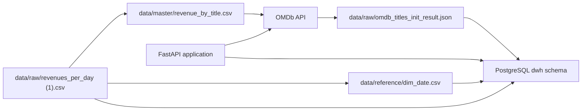
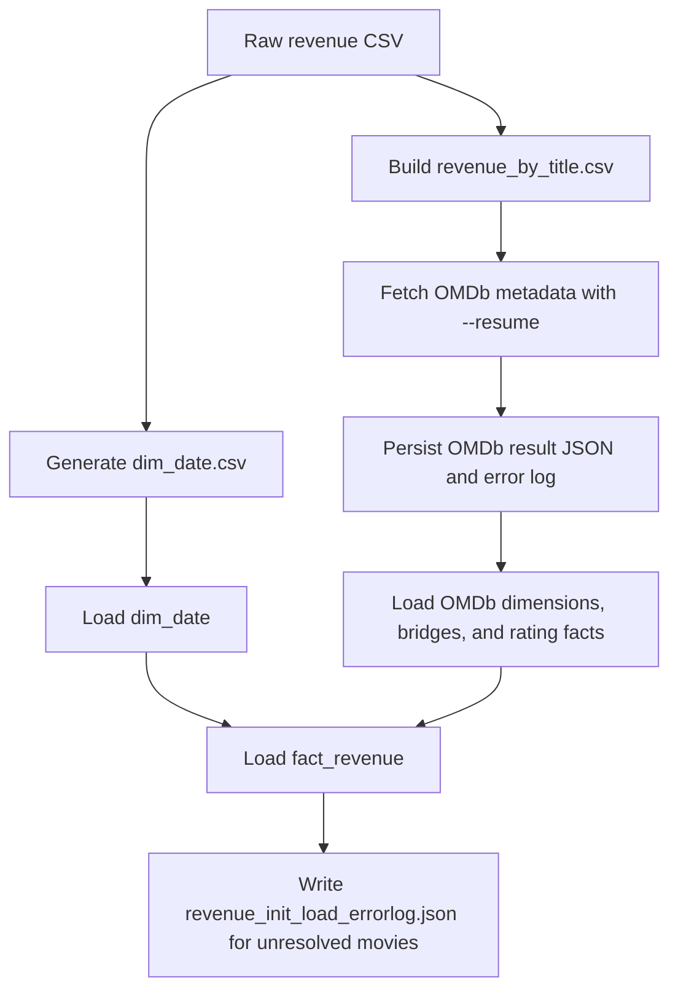
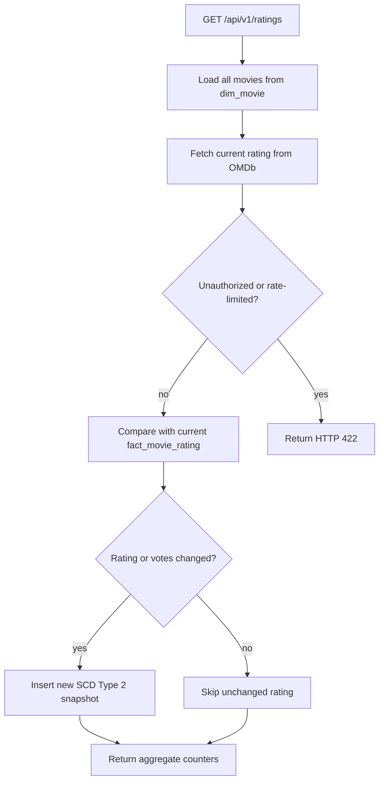
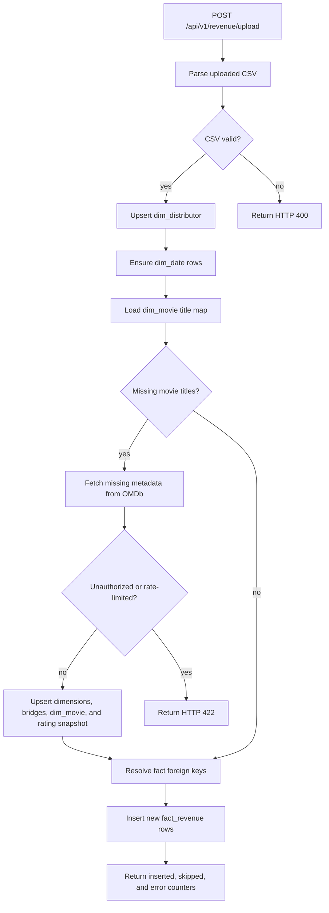

# FM - Movie Box Office Analytics Pipeline

FM is a Python analytics pipeline for loading daily box office revenue,
enriching movie titles with OMDb metadata, storing the result in a PostgreSQL
data warehouse, and exposing FastAPI endpoints for incremental updates.

## Architecture Overview

The solution ingests daily revenue rows from `data/raw/revenues_per_day (1).csv`,
builds master data from the most valuable titles first, enriches those titles
through the OMDb API, and loads the result into the PostgreSQL `dwh` schema.
The free OMDb API key is limited to 1,000 requests per day, as documented on
the [OMDb API key page](https://www.omdbapi.com/apikey.aspx), so the initial
enrichment is resumable and ordered by total revenue.

The application follows the layered `src/` layout:

- `api/` exposes FastAPI routers and request/response schemas.
- `services/` contains ETL orchestration and business workflows.
- `repositories/` contains async SQLModel persistence operations.
- `models/` defines SQLModel DWH tables and DTOs.
- `interfaces/` defines Protocol-based contracts.
- `factories/` centralizes shared resource construction.
- `utils/` contains parsing, mapping, and conversion helpers.
- `config/` owns settings and structured logging initialization.



## Stack

| Component | Library |
|-----------|---------|
| Python | 3.14 |
| API framework | FastAPI + Uvicorn |
| Database | PostgreSQL + asyncpg |
| ORM | SQLModel + SQLAlchemy |
| Migrations | Alembic |
| Data processing | Polars, Pandas |
| HTTP client | httpx |
| Configuration | Pydantic Settings |
| Logging | Loguru |
| Testing | pytest + pytest-asyncio |
| Container runtime | Docker + Docker Compose |

## Setup

The local setup installs dependencies, prepares environment variables, starts
PostgreSQL, applies migrations, and starts the development server.

```bash
poetry install
cp .env.example .env
docker compose up -d db
poetry run alembic upgrade head
poetry run uvicorn src.app:app --reload
```

The Docker PostgreSQL service defaults to host port `5433` to avoid conflicts
with a locally installed PostgreSQL instance on port `5432`. Configure runtime
values in `.env` using `.env.example` as the reference. Do not commit `.env`.

## Running Locally

The application can be run either directly with Poetry or through Docker
Compose.

Run the API directly:

```bash
poetry run uvicorn src.app:app --reload
```

Run the full Docker environment:

```bash
docker compose build
docker compose up -d
```

Run tests:

```bash
poetry run pytest --cov=src --cov-report=term-missing
poetry run pytest tests/unit
poetry run pytest tests/integration
```

## Configuration Reference

Runtime configuration is loaded by `src/config/settings.py` through Pydantic
Settings. Sensitive values must be supplied through environment variables or
`.env` and must not be written into source files or documentation.

| Variable | Type | Default | Required | Description |
|----------|------|---------|----------|-------------|
| `OMDB_API_KEY` | string | none | yes | OMDb API key used for metadata enrichment. |
| `OMDB_BASE_URL` | string | `https://www.omdbapi.com/` | no | Base URL for the OMDb REST API. |
| `POSTGRES_PASSWORD` | string | none | yes | PostgreSQL password. |
| `POSTGRES_HOST` | string | `localhost` | no | PostgreSQL hostname. Docker overrides it to `db`. |
| `POSTGRES_PORT` | integer | `5433` | no | PostgreSQL port used by local execution. |
| `POSTGRES_DB` | string | `fm` | no | PostgreSQL database name. |
| `POSTGRES_USER` | string | `fm_user` | no | PostgreSQL user. |
| `LOG_LEVEL` | string | `INFO` | no | Loguru log level. |

## Database Migrations

Schema changes are managed exclusively through Alembic. Dimensional and fact
tables live in the PostgreSQL `dwh` schema.

```bash
poetry run alembic upgrade head
poetry run alembic current
poetry run alembic downgrade -1
poetry run alembic revision --autogenerate -m "describe change"
```

## Data Warehouse Model

The model in `src/models/dwh_tables.py` is a star schema implemented in the
PostgreSQL `dwh` schema. Repositories map SQLModel table instances to DTOs, so
SQLModel tables are not exposed outside the data access layer.

The DWH contains these dimensions:

- `dim_movie` is the central movie dimension. It stores `imdb_id`, title,
  release year, runtime, plot, awards, OMDb box office amount, OMDb fetch
  timestamp, load timestamp, and a foreign key to `dim_rated`.
- `dim_date` is the calendar dimension. Its `date_id` is a `YYYYMMDD` integer
  key, and the table stores date, year, quarter, month, month name, day,
  day-of-week attributes, week number, weekend flag, and holiday flag.
- `dim_distributor` stores distribution companies with the natural unique key
  `distributor_name`.
- `dim_genre` stores movie genres extracted from OMDb comma-separated fields.
- `dim_director` stores directors extracted from OMDb comma-separated fields.
- `dim_rated` stores rating codes such as `PG-13` and `R` with human-readable
  descriptions.

The model uses bridge tables for many-to-many relationships:

- `bridge_movie_genre` links movies to one or more genres.
- `bridge_movie_director` links movies to one or more directors.

The model has two fact categories:

- `fact_revenue` stores daily revenue facts from `revenues_per_day (1).csv`.
  Its grain is one source row per movie, date, and distributor. It stores
  `source_row_id` for idempotency, foreign keys to `dim_movie`, `dim_date`, and
  `dim_distributor`, `revenue` as `NUMERIC(18, 2)`, theater count, and load
  timestamp.
- `fact_movie_rating` stores rating snapshots derived from OMDb master data.
  It is modeled as Slowly Changing Dimension Type 2 with `imdb_rating`,
  `imdb_votes`, `valid_from`, `valid_to`, and `is_current`. When a rating or
  vote count changes, the previous current row is closed and a new current
  snapshot is inserted.

Key persistence characteristics:

- Natural keys such as `imdb_id`, `source_row_id`, and dictionary names are
  used for idempotent upserts.
- `fact_revenue.source_row_id` prevents duplicate fact rows on repeated loads.
- `fact_movie_rating` keeps historical rating changes rather than overwriting
  previous values.
- All persistence is performed through repository classes with injected async
  sessions.

## Input Data Preparation

The data folders separate raw inputs, generated master data, and reference
dimensions.

- `data/raw/` contains unprocessed source data, including
  `data/raw/revenues_per_day (1).csv`, OMDb result JSON files, and error logs.
- `data/master/` contains master files derived from raw data, including
  `data/master/revenue_by_title.csv`.
- `data/reference/` contains reusable reference files, including
  `data/reference/dim_date.csv`.

## Initial Load Pipeline

The initial load prepares title master data, downloads OMDb metadata, maps that
metadata into DWH structures, builds the date dimension, and finally loads
daily revenue facts.



### Step 1: Build `revenue_by_title.csv`

`scripts/build_revenue_by_title_master.py` reads
`data/raw/revenues_per_day (1).csv`, optionally fixes embedded Unicode escape
artifacts in titles, aggregates total revenue by title, sorts by
`total_revenue` descending, and writes `data/master/revenue_by_title.csv`.
Processing the highest-grossing titles first makes the OMDb request budget more
useful under the free-tier limit.

```bash
poetry run python scripts/build_revenue_by_title_master.py
```

### Step 2: Fetch Initial OMDb Metadata

`scripts/run_omdb_enrichment_etl.py` reads titles from
`data/master/revenue_by_title.csv`, calls the OMDb API, writes successful
responses to `data/raw/omdb_titles_init_result.json`, and records failed or
not-found titles in `data/raw/omdb_titles_init_errorlog.json`.

The `--resume` mode skips titles already present in the result JSON, merges new
records into existing output files, and retries previously failed titles.

```bash
poetry run python scripts/run_omdb_enrichment_etl.py --resume
```

### Step 3: Load OMDb Master And Dimensional Data

`scripts/run_omdb_dwh_init_load.py` runs `OmdbDwhInitLoadService`. This step
does not call the OMDb API. It reads `data/raw/omdb_titles_init_result.json`,
parses validated OMDb records, and maps them into DWH structures.

The service loads data in foreign-key order:

- Upserts `dim_rated`, `dim_genre`, and `dim_director`.
- Upserts `dim_movie`.
- Upserts `bridge_movie_genre` and `bridge_movie_director`.
- Inserts initial rating snapshots into `fact_movie_rating`.

The process is idempotent because dictionary tables and movies are upserted,
bridge rows are upserted, and rating facts are inserted only when the current
rating values require a new snapshot.

```bash
poetry run python scripts/run_omdb_dwh_init_load.py
```

### Step 4: Build `dim_date`

`scripts/seed_dim_date.py` generates `data/reference/dim_date.csv`. The range
starts at the minimum revenue date found in the source revenue data and ends at
`2030-12-31`. The `date_id` is built as a `YYYYMMDD` integer key.

```bash
poetry run python scripts/seed_dim_date.py
```

During container startup, `scripts/load_dim_date.py` is used instead. It loads
the already generated `data/reference/dim_date.csv` into PostgreSQL without
regenerating the file.

### Step 5: Load Initial Revenue Facts

`scripts/run_revenue_init_load.py` runs `RevenueInitLoadService`. The service
reads `data/raw/revenues_per_day (1).csv`, upserts missing distributors into
`dim_distributor`, ensures all dates exist in `dim_date`, loads the title map
from `dim_movie`, resolves each source row to `movie_id`, `date_id`, and
`distributor_id`, and inserts resolved rows into `fact_revenue`.

The load is incremental and idempotent because `source_row_id` is unique and
duplicate inserts are skipped. Rows whose titles cannot be resolved to
`dim_movie` are not loaded into `fact_revenue`; they are written to
`data/raw/revenue_init_load_errorlog.json`.

```bash
poetry run python scripts/run_revenue_init_load.py
```

## Docker Deployment

The Docker distribution starts PostgreSQL and the FastAPI application with the
same DWH bootstrap sequence used by the local ETL scripts.

`docker-compose.yml` defines:

- `db`, a PostgreSQL 17 container using the `fm_pgdata` volume for persistent
  database storage.
- `app`, the FastAPI service built from `Dockerfile`.
- `fm_network`, an explicit bridge network shared by both containers.

The application image contains source code, Alembic migrations, scripts, and
the `data` directory. The distribution can include the generated master data
and `data/reference/dim_date.csv`; therefore the costly OMDb enrichment process
does not need to run again when `data/raw/omdb_titles_init_result.json` already
exists.

At each application container startup, `docker/entrypoint.sh` performs this
sequence:

1. Wait for PostgreSQL to accept connections.
2. Run `alembic upgrade head`.
3. Load `dim_date` from `data/reference/dim_date.csv`.
4. Skip OMDb enrichment if `data/raw/omdb_titles_init_result.json` exists, or
   run `scripts/run_omdb_enrichment_etl.py` if it does not exist.
5. Load OMDb master data into the DWH with
   `scripts/run_omdb_dwh_init_load.py`.
6. Load revenue facts with `scripts/run_revenue_init_load.py`.
7. Start `uvicorn src.app:app`.

```bash
docker compose build
docker compose up -d
```

## API Endpoints

The running application exposes endpoints for refreshing rating facts and
loading new revenue data.

### `GET /api/v1/ratings`

This endpoint refreshes IMDb ratings for every movie in `dim_movie`. It uses
the OMDb API, looks up each movie by `imdb_id` when available and by title
otherwise, compares the fetched rating and vote count with the current
`fact_movie_rating` row, and inserts a new SCD Type 2 snapshot only when the
values changed. If the rating is unchanged, no new row is inserted. OMDb
authorization failures and daily quota failures return HTTP 422.



### `POST /api/v1/revenue/upload`

This endpoint accepts a multipart CSV file in the same format as
`revenues_per_day.csv`. It parses and validates the CSV, upserts
distributors, ensures missing `dim_date` rows exist, checks whether titles are
already present in `dim_movie`, and enriches missing titles from OMDb. For new
titles, it populates `dim_rated`, `dim_genre`, `dim_director`, `dim_movie`,
`bridge_movie_genre`, `bridge_movie_director`, and the first
`fact_movie_rating` snapshot before inserting revenue facts.

Only new `fact_revenue` rows are loaded. Duplicate rows are skipped by
`source_row_id`, unresolved movies are reported in the response counters, OMDb
authorization and quota failures return HTTP 422, and invalid CSV input returns
HTTP 400.



## Changelog

### [0.1.0] - 2026-06-06

### Added

- Initial DWH model with movie, date, distributor, genre, director, rated,
  bridge, revenue fact, and rating fact tables.
- Initial ETL scripts for title aggregation, OMDb enrichment, OMDb DWH loading,
  date dimension seeding, and revenue fact loading.
- Docker Compose environment with PostgreSQL, Alembic migrations, DWH bootstrap,
  and FastAPI startup.
- API endpoints for rating refresh and incremental revenue CSV upload.
